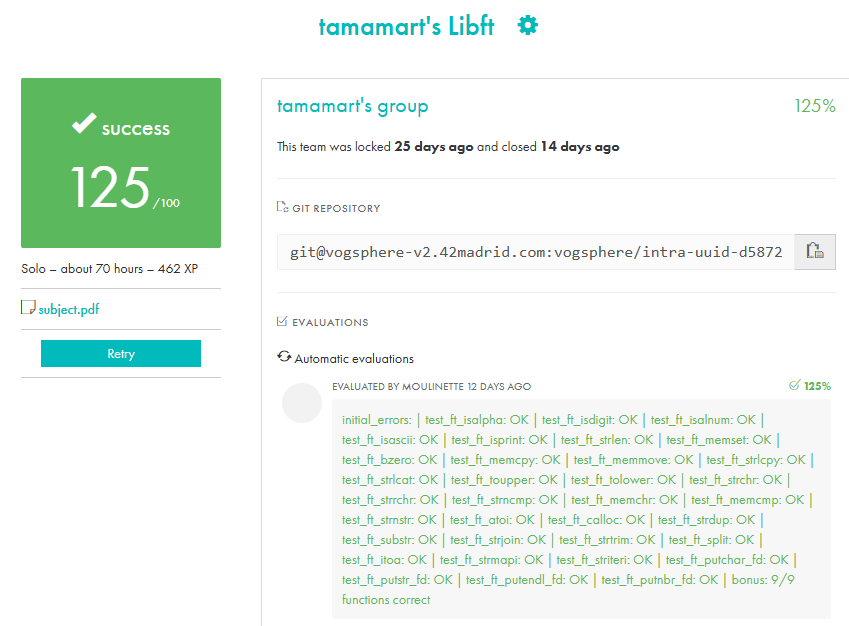

# 🚀 Libft - 42 Madrid


---

## 📌 Descripción

**Libft** es el primer proyecto obligatorio del **cursus 42 Madrid**, cuyo objetivo es **recrear funciones de la biblioteca estándar de C**, así como añadir algunas funciones extra, incluyendo manejo de listas enlazadas, que forman parte del BONUS.

Este proyecto me permitió fortalecer la comprensión de:  
- Manipulación de cadenas y memoria  
- Conversión y validación de datos  
- Gestión de listas enlazadas  
- Compilación y creación de librerías  

**Resultado:** máxima puntuación **125/100** 🎯

---

## 💡 Explicación del proyecto

El propósito de **Libft** es construir una **librería personalizada en C** que replique funciones básicas de la biblioteca estándar (`string.h`, `ctype.h`, `stdlib.h`) y añadir algunas funciones extra para facilitar la manipulación de listas enlazadas.  

Esto permite:  
- **Reutilizar código** en futuros proyectos de 42 sin depender de la biblioteca estándar.  
- **Entender a fondo cómo funcionan las funciones básicas** como `strcpy`, `memcpy`. `memcpy` o `atoi`.  
- **Practicar gestión de memoria**, punteros y estructuras de datos dinámicas, fundamentales en C.  

La librería se organiza en tres bloques principales:  
1. **Funciones de manejo de cadenas y caracteres**: manipulación, búsqueda, conversión.  
2. **Funciones de memoria y conversión**: copia, inicialización, comparaciones, reserva dinámica.  
3. **Funciones de listas enlazadas (bonus)**: creación, inserción, eliminación y recorrido de listas.

---

## 🗂 Contenido del proyecto

### Funciones de cadenas y caracteres
`ft_strlen` | `ft_strdup` | `ft_strchr` | `ft_strrchr` | `ft_strncmp` | `ft_strlcpy` | `ft_strlcat` | `ft_strnstr`  
`ft_strjoin` | `ft_substr` | `ft_strtrim` | `ft_split` | `ft_strmapi` | `ft_striteri`  
`ft_toupper` | `ft_tolower` | `ft_isalpha` | `ft_isdigit` | `ft_isalnum` | `ft_isascii` | `ft_isprint` | `ft_is_lower` | `ft_is_upper`  

### Funciones de memoria
`ft_memset` | `ft_bzero` | `ft_memcpy` | `ft_memmove` | `ft_memchr` | `ft_memcmp` | `ft_calloc`

### Funciones de conversión
`ft_atoi` | `ft_itoa`

### Funciones de salida por descriptor
`ft_putchar_fd` | `ft_putstr_fd` | `ft_putendl_fd` | `ft_putnbr_fd`

### Funciones de listas enlazadas (Bonus)
`ft_lstnew_bonus` | `ft_lstadd_front_bonus` | `ft_lstadd_back_bonus` | `ft_lstsize_bonus` | `ft_lstlast_bonus` | `ft_lstdelone_bonus` | `ft_lstclear_bonus` | `ft_lstiter_bonus` | `ft_lstmap_bonus`

---

## ⚡ Uso

1. Clonar el repositorio:

```bash
git clone https://github.com/maramartinezvargas/libft.git
cd libft
````

2. Compilar la librería:

```bash
make
```

---

## 🛠️ Tecnologías usadas


---

## 👩‍💻 Autor

**Mara Martínez (tamamart)**
📧 `tamamart@student.42madrid.com`

---

## 🏆 Mi puntuación

> Máxima puntuación obtenida: **125/100** 🎯
[](score-libft-tamamart.png)

---


